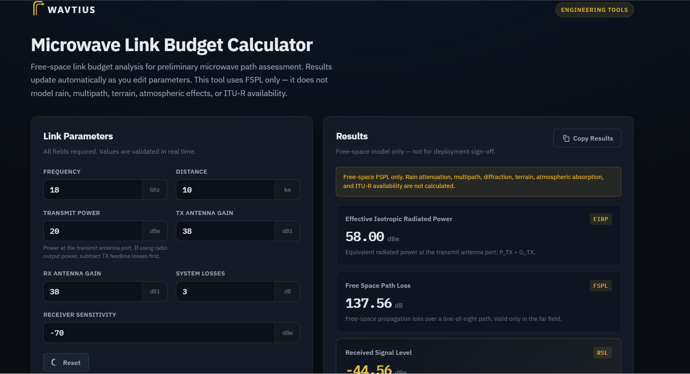

# WAVTIUS Microwave Link Budget Calculator

## 🚀 Live Demo

👉 [Launch the Live Demo](https://wavtius.github.io/wavtius-engineering-tools/link-budget-calculator/)

Professional free-space microwave link budget calculator for preliminary point-to-point path assessment, designed for RF engineers, wireless consultants, telecom professionals, researchers, and students.

**Powering Wireless Innovation**

## Source Code

Clone or download this repository, then open `index.html` in any modern web browser.

No installation required.
No build tools.
No server required.

---

# Project Overview

<p align="center">
  
</p>

The WAVTIUS Microwave Link Budget Calculator performs **free-space** link budget analysis for point-to-point microwave paths. It computes Effective Isotropic Radiated Power (EIRP), Free Space Path Loss (FSPL), Received Signal Level (RSL), and Link Margin from user-supplied parameters, then compares the calculated RSL against the entered receiver sensitivity using a **PASS / FAIL (Sensitivity)** indicator and free-space advisory recommendations.

Designed as the first tool in the **WAVTIUS Engineering Tools** collection, this static web application has zero runtime dependencies and is intended for **preliminary engineering assessment** rather than final microwave deployment sign-off.

| Item | Detail |
|------|--------|
| Product | WAVTIUS Microwave Link Budget Calculator |
| Organization | WAVTIUS |
| Audience | RF engineers, wireless consultants, telecom operators, students |
| Runtime | Static web application |
| Stack | HTML, CSS, Vanilla JavaScript |
| License | MIT License |
---

# Features

- Real-time engineering calculations
- Automatic updates while typing
- Engineering calculations:
  - Effective Isotropic Radiated Power (EIRP)
  - Free Space Path Loss (FSPL)
  - Received Signal Level (RSL)
  - Link Margin
- PASS / FAIL (Sensitivity) assessment
- Free-space engineering recommendations
- Real-time input validation
- Engineering warning messages
- Copy Results to clipboard
- Reset to default values
- Responsive interface
- Dark engineering theme
- Accessible interface (ARIA, keyboard navigation, focus indicators)

---

# Engineering Assumptions

This calculator intentionally implements a **simplified Free-Space Link Budget model**.

The following assumptions apply:

| Assumption | Description |
|------------|-------------|
| Propagation model | Free Space Path Loss (FSPL) only |
| Environment | Clear Line-of-Sight (LOS) |
| Obstacles | Not modelled |
| Rain attenuation | Not modelled |
| Multipath | Not modelled |
| Atmospheric absorption | Not modelled |
| Earth curvature | Not modelled |
| Fresnel clearance | Not modelled |
| Interference | Not modelled |
| Receiver sensitivity | User-defined |
| Polarization | Assumed ideal |
| Antenna alignment | Assumed perfect |

### Transmit Power Reference

**Transmit Power (P_TX)** represents the **conducted power at the transmit antenna port**.

If the available value is the **radio output power**, subtract the **TX feedline losses** before entering **Transmit Power**.

### System Losses

**System Losses (L_sys)** represent a lumped RF loss including receiver feedline, connectors, radome, branching, and miscellaneous system losses.

Displayed values are rounded to **two decimal places**.

---
# Engineering Equations

The calculator uses the following engineering equations.

## Effective Isotropic Radiated Power (EIRP)

```text
EIRP = P_TX + G_TX
```

Where:

- **P_TX** = Conducted power at the transmit antenna port
- **G_TX** = Transmit antenna gain

> **Note**
>
> `P_TX` in all equations represents the conducted power at the transmit antenna port.
>
> If only the radio output power is available, subtract the TX feedline losses before applying these equations.

---

## Free Space Path Loss (FSPL)

```text
FSPL = 92.45 + 20 log10(fGHz) + 20 log10(dkm)
```

Where:

- Frequency = GHz
- Distance = km

The constant **92.45 dB** is the standard form of the Friis free-space equation using kilometres and gigahertz.

---

## Received Signal Level (RSL)

```text
P_RX = P_TX + G_TX + G_RX − FSPL − L_sys
```

Where:

- **G_RX** = Receive antenna gain
- **L_sys** = Lumped system losses

---

## Link Margin

```text
Margin = P_RX − Receiver Sensitivity
```

---

## Link Recommendation Thresholds

These recommendations apply only to the **free-space sensitivity margin**.

| Link Margin | Recommendation |
|-------------|----------------|
| >25 dB | Strong free-space margin above sensitivity |
| 15–25 dB | Adequate free-space margin above sensitivity |
| 10–15 dB | Limited free-space margin above sensitivity |
| 0–10 dB | Low free-space margin — evaluate with complete propagation models |
| <0 dB | FAIL (Sensitivity) | 

---

# Known Limitations

This release intentionally **does not include**:

- Rain attenuation
- ITU-R P.530 availability calculations
- Multipath fading
- Atmospheric gas absorption
- Diffraction loss
- Terrain profile
- Fresnel Zone clearance
- Earth curvature
- Thermal noise analysis
- Receiver noise figure calculations
- Interference analysis
- Automatic antenna gain calculations
- Equipment databases
- Unit conversion

Results from this tool are suitable for **preliminary path assessment, engineering studies, and educational purposes**.

Final microwave designs require complete propagation, availability, interference, and equipment-specific analysis.

---

# Getting Started

No installation is required.

Simply:

1. Download or clone the repository.
2. Open `index.html` in any modern web browser.

No server, Node.js, or build tools are required.

---

# Optional Verification Tests

Node.js is only required for running automated verification tests.

```bash
node tests/verify.mjs
node tests/validation.mjs
node tests/integration-smoke.mjs
```

---

# Usage

1. Open `index.html`.
2. Enter the required link parameters.

   **Note**

   If entering **radio output power** instead of **antenna-port power**, subtract the **TX feedline losses** before entering **Transmit Power**.

3. Review the engineering outputs.
4. Check the **PASS / FAIL (Sensitivity)** assessment.
5. Review the engineering recommendation.
6. Use **Copy Results** if required.
7. Use **Reset** to restore the default parameters.

---

# Default Parameters

| Input | Default |
|------|------|
| Frequency | 18 GHz |
| Distance | 10 km |
| Transmit Power | 20 dBm |
| TX Antenna Gain | 38 dBi |
| RX Antenna Gain | 38 dBi |
| System Losses | 3 dB |
| Receiver Sensitivity | -70 dBm |

---

# Expected Results

Using the default parameters above:

| Output | Value |
|------|------|
| EIRP | 58.00 dBm |
| FSPL | 137.56 dB |
| RSL | -44.56 dBm |
| Link Margin | 25.44 dB |
| Status | PASS (Sensitivity) |
| Recommendation | Strong free-space margin above sensitivity |

---

# Project Structure

```text
wavtius-link-budget-calculator/
├── assets/
│   └── wavtius-logo.svg
├── css/
│   └── styles.css
├── js/
│   ├── domain/
│   │   └── linkBudget.js
│   ├── application/
│   │   └── calculateLinkBudget.js
│   └── ui/
│       └── app.js
├── tests/
│   ├── verify.mjs
│   ├── validation.mjs
│   └── integration-smoke.mjs
├── index.html
├── LICENSE
└── README.md
```

---

# Architecture

The application follows a simple three-layer architecture that separates the user interface, application logic, and engineering calculations.

```text
User Input
      │
      ▼
UI Layer (app.js)
      │
      ▼
Application Layer (calculateLinkBudget.js)
      │
      ▼
Domain Layer (linkBudget.js)
      │
      ▼
Engineering Calculations
      │
      ▼
Formatted Results
      │
      ▼
User Interface
```

---

# References

This calculator follows widely accepted RF engineering principles and standard free-space propagation equations.

- Friis Transmission Equation
- ITU-R Recommendation P.525 (Free-Space Propagation)
- Standard Microwave Link Budget Methodology
- IEEE RF and Microwave Engineering Standards

---

# About WAVTIUS

WAVTIUS develops professional engineering software for microwave and wireless network planning.

The **WAVTIUS Engineering Tools** collection provides lightweight, practical engineering utilities for RF professionals, consultants, network planners, researchers, and students.

This calculator is intended for rapid **free-space link budget estimation** during preliminary engineering studies and should be used together with complete propagation and availability analysis for production network design.

**Powering Wireless Innovation**

© 2026 WAVTIUS
